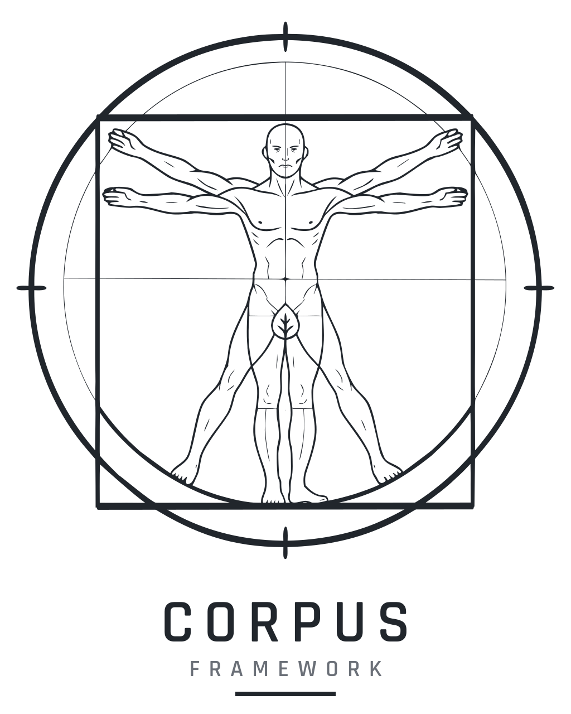
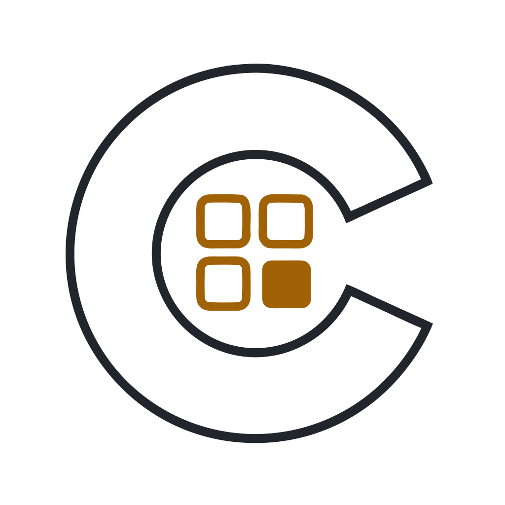
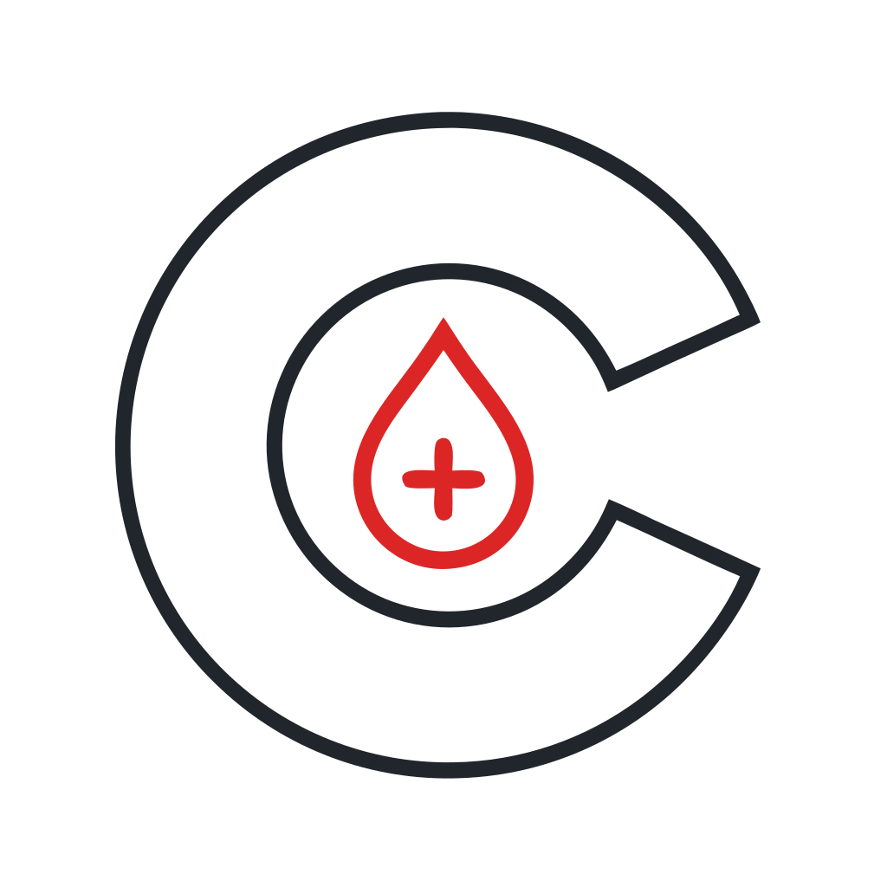
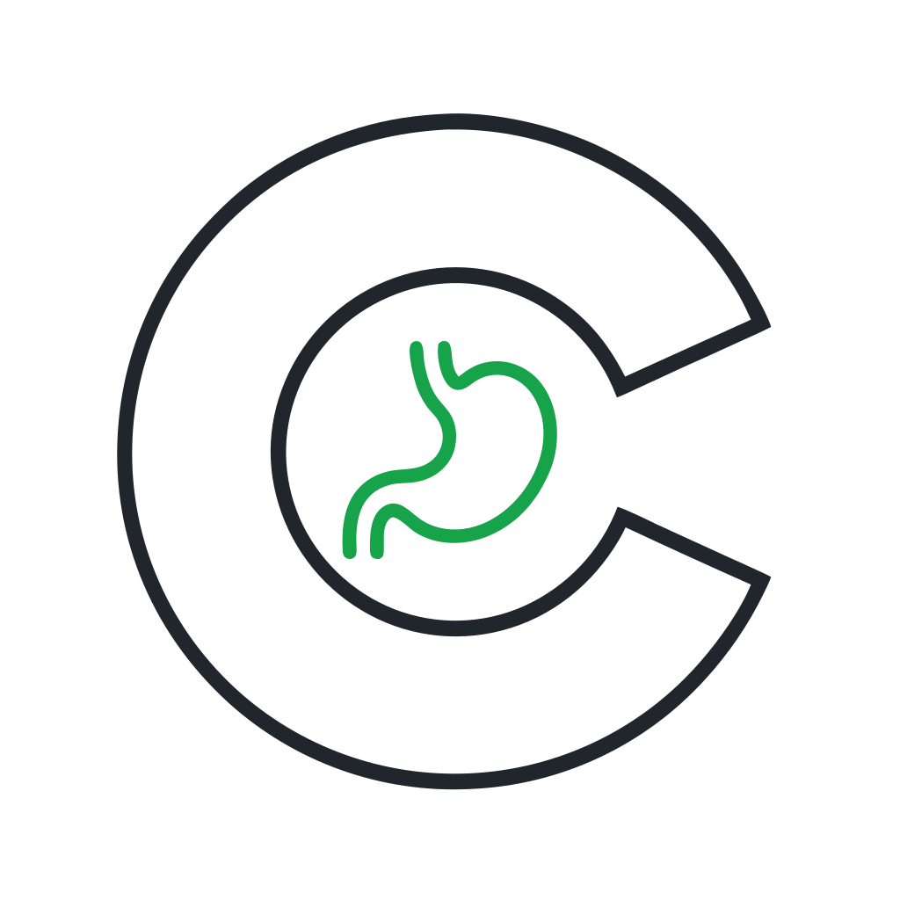
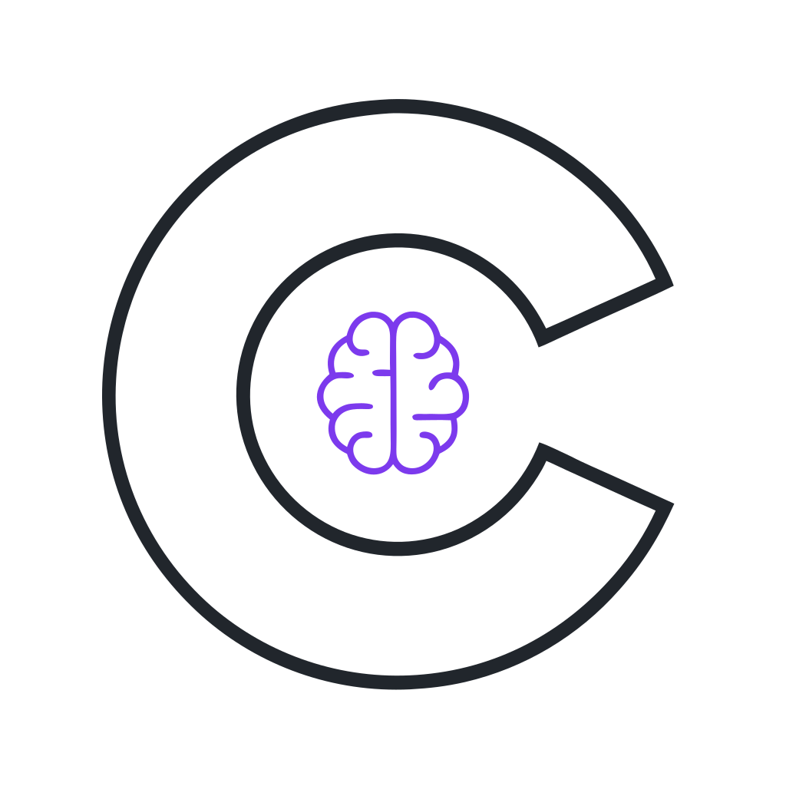
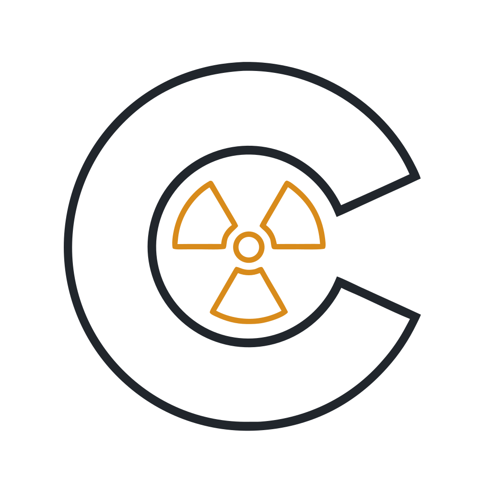

<p align="center">
  <picture>
    <source media="(prefers-color-scheme: dark)" srcset="assets/corpus_lockup_dark.svg">
    
  </picture>
</p>

<p align="center">
  <a href="https://github.com/Sepuldosky/corpus-caliber"><picture><source media="(prefers-color-scheme: dark)" srcset="assets/caliber_logo_dark.svg"></picture></a>
  &nbsp;&nbsp;&nbsp;
  <a href="https://github.com/Sepuldosky/corpus-cargo"><picture><source media="(prefers-color-scheme: dark)" srcset="assets/cargo_logo_dark.svg"></picture></a>
  &nbsp;&nbsp;&nbsp;
  <a href="https://github.com/Sepuldosky/corpus-coagulant"><picture><source media="(prefers-color-scheme: dark)" srcset="assets/coagulant_logo_dark.svg"></picture></a>
  &nbsp;&nbsp;&nbsp;
  <a href="https://github.com/Sepuldosky/corpus-craving"><picture><source media="(prefers-color-scheme: dark)" srcset="assets/craving_logo_dark.svg"></picture></a>
  &nbsp;&nbsp;&nbsp;
  <a href="https://github.com/Sepuldosky/corpus-cortex"><picture><source media="(prefers-color-scheme: dark)" srcset="assets/cortex_logo_dark.svg"></picture></a>
</p>

<p align="center"><sub>C A L I B E R &nbsp;·&nbsp; C A R G O &nbsp;·&nbsp; C O A G U L A N T &nbsp;·&nbsp; C R A V I N G &nbsp;·&nbsp; C O R T E X</sub></p>

<p align="center">
  <a href="https://github.com/Sepuldosky/corpus-stalker"><picture><source media="(prefers-color-scheme: dark)" srcset="assets/stalker_logo_dark.svg"></picture></a>
</p>

<p align="center"><sub>y el addon de contenido — <b>S T A L K E R</b></sub></p>

# Corpus

Framework **delgado** para **Garry's Mod** que aloja un ecosistema de módulos de gameplay
realista para el Sandbox. Cada módulo es un addon independiente que declara a Corpus como su
única dependencia dura; el usuario instala solo los módulos que quiere, o todos, y cada
combinación produce un sistema honesto — no una mitad rota. Analogía en el mismo stack:
**VJ Base + SNPCs**, **ARC9 + weapon packs**.

## El ecosistema

| Módulo | Dominio | Estado |
|---|---|---|
| [**Caliber**](https://github.com/Sepuldosky/corpus-caliber) | Combate: armadura zonal estilo EFT, escudos de energía, HP por extremidad, penetración balística | En código, verificado |
| [**Cargo**](https://github.com/Sepuldosky/corpus-cargo) | Inventario estilo STALKER/GAMMA: grid, framework de ítems, equipamiento, contenedores, comercio | En código, verificado |
| [**Coagulant**](https://github.com/Sepuldosky/corpus-coagulant) | Médico de jugador estilo ACE3: heridas por zona, sangrado, vitales, tratamiento, debuffs zonales | En código, verificado |
| [**Craving**](https://github.com/Sepuldosky/corpus-craving) | Supervivencia de jugador: hambre e hidratación | En código, verificado |
| [**Cortex**](https://github.com/Sepuldosky/corpus-cortex) | IA de NPC: táctica de combate + afecto (dolor, miedo) | Sin empezar |

Aparte de los cinco módulos, [**Corpus S.T.A.L.K.E.R.**](https://github.com/Sepuldosky/corpus-stalker)
es el addon de **contenido** de la Zona (anomalías, artefactos, PDA, detectores, defs de NPC e
ítem). No es un módulo: el framework y los módulos son **genéricos** — no saben nada de la Zona —
y el addon de contenido es el que los convierte en un juego concreto, consumiéndolos sin subirles
nada.

Dos reglas cardinales sostienen el diseño:

- **Corpus es delgado.** Solo aloja infraestructura demostrablemente compartida; ninguna
  lógica de dominio (armor math, curvas de sangrado, grid de inventario) sube al framework —
  vive en su módulo dueño y el resto la consume vía el registro.
- **La única dependencia dura es Corpus.** Todo cruce entre módulos es soft-dependency:
  se detecta en runtime (`Corpus.GetModule`/`Corpus.HasModule`), nunca se asume, y degrada
  con gracia si el partner no está.

## La API — 6 primitivas

| Primitiva | Contrato |
|---|---|
| **Registro** | `Corpus.RegisterModule(name, iface)` · `Corpus.HasModule(name)` · `Corpus.GetModule(name)` |
| **Persistencia** | `Corpus.Data.Save/Load(module, key, tbl)` → `data/corpus/<module>/<key>.json` |
| **Net** | `Corpus.Net.Register(module, msgName)` → `"corpus_<module>_<msgName>"` |
| **UI shell** | `Corpus.UI.RegisterTab(module, label, buildFn)` — categoría única "Corpus" en el menú Q (Utilities) |
| **Ready barrier** | `Corpus.OnReady(fn)` — corre una vez tras `InitPostEntity`, con todos los módulos registrados |
| **Log** | `Corpus.Log(module, ...)` — prefijo `[Corpus:<module>]` |

Detalle completo (firmas, invariante by-ref del registro, fronteras de módulo) →
[`docs/CORPUS_Architecture.md`](docs/CORPUS_Architecture.md) §3.

## Instalación

Clonar en `garrysmod/addons/` (aún sin release en Workshop):

```
garrysmod/addons/corpus/            ← este repo (requerido por todos los módulos)
garrysmod/addons/corpus-<modulo>/   ← los módulos que quieras
```

Verificación rápida: el comando de consola `corpus_selftest` auto-testea las primitivas en
el realm donde corre (en listen server, realm server: `lua_run Corpus._SelfTest()`).

## Documentación

- [`docs/CORPUS_Architecture.md`](docs/CORPUS_Architecture.md) — diseño del framework, grafo de dependencias, workspace.
- [`docs/corpus_estado.md`](docs/corpus_estado.md) · [`docs/corpus_roadmap.txt`](docs/corpus_roadmap.txt) · [`docs/CHANGELOG.md`](docs/CHANGELOG.md) — docs vivos.
- [`docs/corpus_flujo_trabajo.txt`](docs/corpus_flujo_trabajo.txt) — metodología de trabajo, canónica para los siete repos del ecosistema.
- [`docs/Corpus_Identidad.md`](docs/Corpus_Identidad.md) — identidad visual: marca madre, familia de glifos, paleta de acento, uso de los assets.
- [`CLAUDE.md`](CLAUDE.md) — guía para asistencia con Claude Code.
